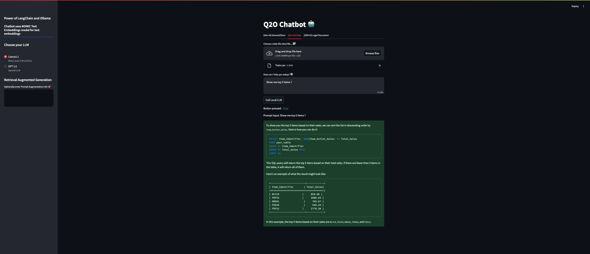

# GenAI LLM Chatbot 🤖

[](LICENSE)

GenAI LLM Chatbot is an intelligent chatbot built to interact with users and provide insightful data analysis capabilities. It allows users to chat with **PDF** and **CSV** files, as well as compare PDFs for possible similarities and differences. This project combines powerful tools like Streamlit, Python, Ollama, LangChain, and more to deliver an intuitive, AI-powered interface.

## Table of Contents

- [Features](#features)
- [Demo](#demo)
- [Installation](#installation)
- [Usage](#usage)
- [Technologies Used](#technologies-used)
- [Future Improvements](#future-improvements)
- [Contributing](#contributing)
- [License](#license)
- [Acknowledgements](#acknowledgements)

---

## Features

- **Chat with PDF and CSV Files**: Upload a document or dataset, and the chatbot intelligently answers questions related to the content.
- **Compare PDFs**: Identify similarities and differences between two PDF documents.
- **Data Insights**: Use advanced text embedding models to summarize, query, and analyze uploaded data.
- **Retrieval Augmented Generation (RAG)**: Enhance responses with context-driven retrieval capabilities.
- **Interactive UI**: Built with Streamlit for an intuitive and user-friendly experience.
- **Customizable LLMs**: Choose between different large language models (e.g., Llama 3.1 and GPT-3.5).

---

## Demo

## 

## Installation

Follow these steps to set up the project locally:

### Prerequisites

- Python 3.8 or higher
- Pip package manager
- GPU-enabled environment for running large models (optional but recommended)

### Steps

1. **Clone the Repository**:

   ```bash
   git clone https://github.com/muntakim1/genai-llm-chatbot.git
   cd genai-llm-chatbot
   ```

2. **Create a Virtual Environment**:

   ```bash
   python -m venv venv
   source venv/bin/activate    # On Windows: venv\Scripts\activate
   ```

3. **Install Dependencies**:

   ```bash
   pip install -r requirements.txt
   ```

4. **Set Up Environment Variables**:

   - Download ollama:
     ```shell
        ollama pull nomic-embed-text
        ollama pull llama3.1
     ```

5. **Run the Application**:

   ```bash
   streamlit run app.py
   ```

6. **Access the App**:
   Open your browser and navigate to `http://localhost:8501`.

---

## Usage

1. **Upload Files**:

   - Drag and drop your **PDF** or **CSV** files into the application.
   - The chatbot will parse the file and allow you to interact with its content.

2. **Query Files**:

   - Use the chat interface to ask questions about the uploaded file.
   - Example: "What are the top 5 items based on sales in this dataset?"

3. **Compare PDFs**:

   - Upload two PDFs to find similarities and differences.
   - Example use cases: contract analysis, document comparison.

4. **Switch Between LLMs**:
   - Choose between local and cloud-based models like Llama 3.1 and GPT-3.5 for responses.

---

## Technologies Used

- **Streamlit**: For building the web-based UI.
- **Python**: The core programming language.
- **LangChain**: For implementing LLM-driven workflows.
- **Ollama**: For managing local LLM inference.
- **Llama 3.1**: A local LLM used for querying and analyzing data.
- **Nomic-Embed-Text**: For text embedding and similarity analysis.
- **CSV and PDF Parsing**: Tools for extracting data from documents.

---

## Future Improvements

- Add support for more file formats (e.g., Word documents, Excel files).
- Implement advanced visualization tools for data exploration.
- Enhance PDF comparison with detailed diff highlighting.
- Introduce multilingual support for file interaction and queries.
- Add authentication and user management for secure access.

---

## Contributing

Contributions are welcome! 🎉

1. **Fork the Repository**:
   Click the "Fork" button at the top of this page to create a copy of this repository under your account.

2. **Clone the Fork**:

   ```bash
   git clone https://github.com/muntakim1/genai-llm-chatbot.git
   ```

3. **Create a Feature Branch**:

   ```bash
   git checkout -b feature-name
   ```

4. **Make Changes**:

   - Add new features, fix bugs, or improve documentation.
   - Commit your changes with a descriptive message:
     ```bash
     git commit -m "Add feature-name"
     ```

5. **Submit a Pull Request**:
   - Push your branch to your forked repository:
     ```bash
     git push origin feature-name
     ```
   - Open a pull request against the main repository.

---

## License

This project is licensed under the [MIT License](LICENSE).
You are free to use, modify, and distribute this software in accordance with the license.

---

## Acknowledgements

- [Streamlit](https://streamlit.io/) for the amazing UI framework.
- [LangChain](https://langchain.com/) for simplifying LLM integration.
- [Ollama](https://www.ollama.ai/) for local model hosting.
- [Llama 3.1](https://meta.ai/) for powerful local language modeling.
- [Nomic](https://www.nomic.ai/) for text embedding and similarity tools.

> Created with ❤️ by [Muntakim](https://github.com/muntakim1)
